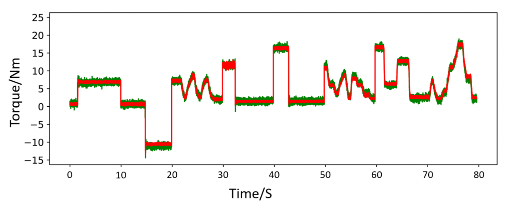
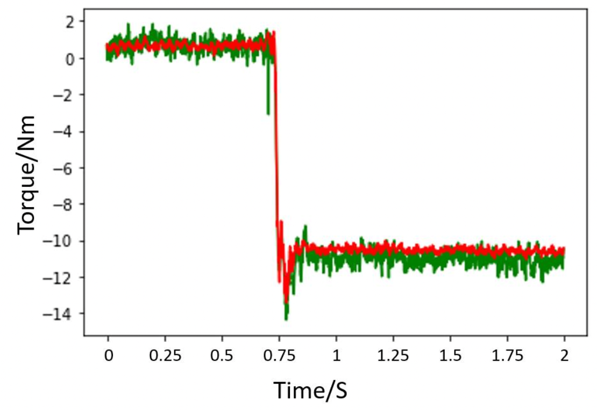

# Denoising Torque Measurement Data using AI

This document provides a brief bullet-point introduction to help understand the accompanying Python code.
The code is for information only and is non-operational without the associated datasets.

## Project Summary
- Torque measurement has traditionally used intrusive and expensive inline devices.
- This is impractical when considering huge rotating devices such as wind turbines.
- A PhD student at Durham University previously proposed measuring drive train torque using
a contactless, shaft-twist based method.
- Black and white coded strips are placed at each end of the drive train and their values read
using optical sensors.
- The impulses observed were in synchronization under no load but become out of phase as
the applied torque increased due to twisting of the drive shaft.
- This twist is linear over the operational range and can be used as an accurate predictor of
torque experienced.
- The sensor readings are however very noisy, requiring significant processing to produce
usable data.
- This project explores the use of neural networks to improve this de-noising process to
accurately generate torque values from the noisy optical sensor data in real time.

## Neural Network Architecture
Several different neural network architectures have been compared to find the optimal solution. The attached code implements one of these with the following characteristics:
- Three 1D convolution interleaved with max pooling layers provide feature extraction.
- A 1000 unit gated recurrent unit layer applied to the output feature maps to identify any
long term dependencies.
- Two fully connected layers which perform regression to deliver the predicted torque via the
output layer.

## Example results
Below are a couple of sample results generated by this code when run against a reference dataset.

- The actual torque as measured by an inline torque meter is shown in green.
- The calculated torque values produced by neural network is shown in red.
- The mean-squared-error on unseen data is 0.24𝑁2𝑚2.
- This is significantly better than that produced by traditional arithmetic methods.
- Results are produced in near real-time from a data stream of 1000 data points per second.

The project supervisor is extremely happy with these results.

